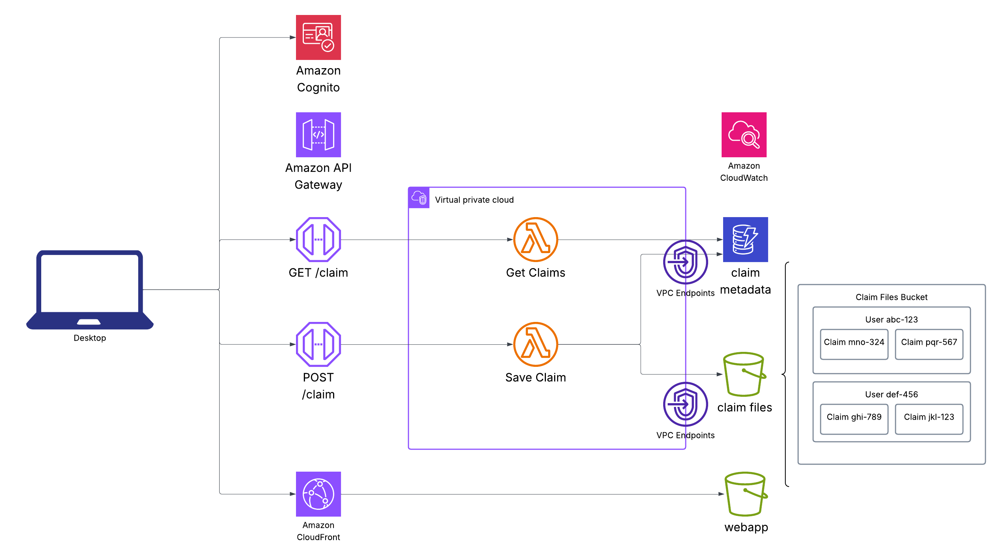

Claim Management Backend and Frontend

# Design

# Deploymment
These commands shouold be executed from the project root

### 1. Initialize terraform
`terraform -chdir=infra init`

### 2. Configure tfvars

Set `local` to `true` to configure API Gateway CORS and Cognito callback URIs for local deployment. 

### 2. Apply terraform
`terraform -chdir=infra apply`

This will automatically create the .env file for the frontend

### 3. Build Webapp
`npm -prefix frontend i`
`npm -prefix frontend run build`

### 4. Deploy Webapp
Use the `webapp_deploy_command` output from terraform

`aws s3 cp --recursive frontend/dist/ s3://<FRONTEND_BUCKET>/`

### 5. Interact with deployed Claim Portal

Navigate to the cloudfront endpoint

# Backend

Python lambdas to handle uploading and retrieving claims

# Frontend

Vite React Typescript 

Uses Amplify for Auth component

Uses Cloudcape for styling and components

# KNOWN ISSUES

- Webapp sign in asks for email confirmation when user is already confirmed

